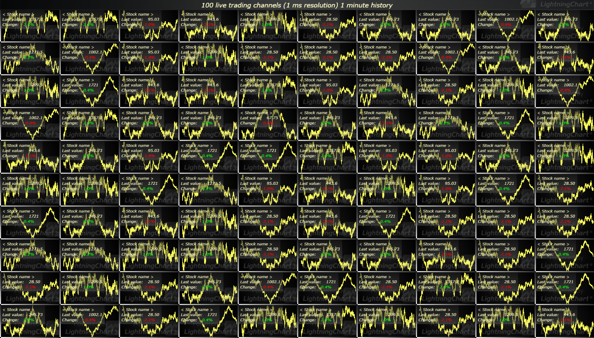
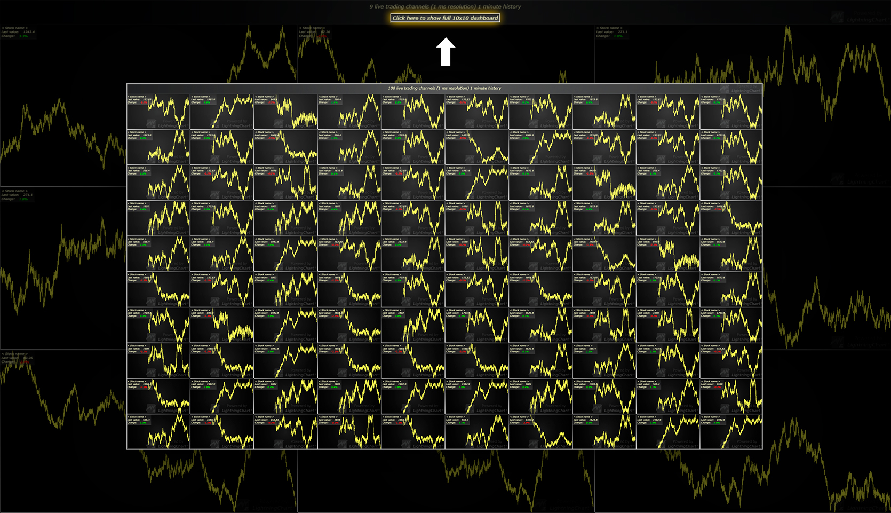

# JavaScript Real-Time Trading Dashboard

This demo application belongs to the set of examples for LightningChart JS, data visualization library for JavaScript.

LightningChart JS is entirely GPU accelerated and performance optimized charting library for presenting massive amounts of data. It offers an easy way of creating sophisticated and interactive charts and adding them to your website or web application.

The demo can be used as an example or a seed project. Local execution requires the following steps:

- Make sure that relevant version of [Node.js](https://nodejs.org/en/download/) is installed
- Open the project folder in a terminal:

        npm install              # fetches dependencies
        npm start                # builds an application and starts the development server

- The application is available at *http://localhost:8080* in your browser, webpack-dev-server provides hot reload functionality.

## Description

This example showcases how LightningChart JS can be used to enable next-generation Fintech chart applications.

As proven in our [2021 line charts performance comparison](https://www.arction.com/javascript-charts-performance-comparison/), LightningChart JS line charts are **over 700 times faster** than other web charts. Especially in real-time applications LightningChart enables the creation of data visualization applications unlike anything seen before in web pages.

By default, this example will show a small dashboard that displays the price variation of nine imaginary stock trends in real-time.

**However**, the real treat is activated by pressing the "Click here to show full 10x10 dashboard" button inside the chart. This is intended for Desktop users, as the complete application requires quite a bit of space.

In its full size, the example shows 100 line charts. Each chart is connected to a real-time data source (random data, doesn't reflect any real stock price), the sampling rate is 1 000 data points per second **for every chart**. This sums up to **100 000** processed data points per second.

In addition to this, every chart has a little embedded statistical panel which displays the newest price and the price change between the newest  and oldest visible price.

In the previously mentioned performance comparison study we tested this kind of applications with the major manufacturers who claim their charts to be **high-performance oriented** or **the fastest**. The results showed that the wide majority of web charts are not applicable to real-time visualization of even as little as 1 000 data points per second.

Why not? Because the charts spend too much time processing this amount of data. This can be observed by the web page visibly slowing down, preventing users from interacting with their browser.

To learn more about LightningChart JS and its Fintech capabilities, here are some potentially interesting links:

- [Ultra Precision Fintech Charts](https://www.arction.com/lightningchart-js-interactive-examples/examples/lcjs-example-0024-ultraPrecisionTradingChart.html) (1 microsecond precision!)

- [LC JS Trading + Indicators (Volume, RSI, SMA, EMA) Showcase with real trading data from alphavantage.co](https://arction.github.io/lcjs-showcase-trading/)

- [Candlestick, Area, DateTime features and more](https://www.arction.com/lightningchart-js-interactive-examples/examples/lcjs-example-0502-dashboardTrading.html)

- [Latest news on LC JS performance](https://www.arction.com/high-performance-javascript-charts/)

## API Links

* [Dashboard]
* [XY cartesian chart]
* [Line series]
* [Axis]
* [Axis tick strategies]
* [Axis scroll strategies]
* [UI position origins]
* [UI layout builders]
* [UI element builders]
* [Solid FillStyle]
* [RGBA color factory]
* [Time formatting functions]

## Support

If you notice an error in the example code, please open an issue on [GitHub][0] repository of the entire example.

Official [API documentation][1] can be found on [Arction][2] website.

If the docs and other materials do not solve your problem as well as implementation help is needed, ask on [StackOverflow][3] (tagged lightningchart).

If you think you found a bug in the LightningChart JavaScript library, please contact support@arction.com.

Direct developer email support can be purchased through a [Support Plan][4] or by contacting sales@arction.com.

[0]: https://github.com/Arction/
[1]: https://www.arction.com/lightningchart-js-api-documentation/
[2]: https://www.arction.com
[3]: https://stackoverflow.com/questions/tagged/lightningchart
[4]: https://www.arction.com/support-services/

© Arction Ltd 2009-2020. All rights reserved.

[Dashboard]: https://www.arction.com/lightningchart-js-api-documentation/v3.1.0/classes/dashboard.html
[XY cartesian chart]: https://www.arction.com/lightningchart-js-api-documentation/v3.1.0/classes/chartxy.html
[Line series]: https://www.arction.com/lightningchart-js-api-documentation/v3.1.0/classes/lineseries.html
[Axis]: https://www.arction.com/lightningchart-js-api-documentation/v3.1.0/classes/axis.html
[Axis tick strategies]: https://www.arction.com/lightningchart-js-api-documentation/v3.1.0/globals.html#axistickstrategies
[Axis scroll strategies]: https://www.arction.com/lightningchart-js-api-documentation/v3.1.0/globals.html#axisscrollstrategies
[UI position origins]: https://www.arction.com/lightningchart-js-api-documentation/v3.1.0/globals.html#uiorigins
[UI layout builders]: https://www.arction.com/lightningchart-js-api-documentation/v3.1.0/globals.html#uilayoutbuilders
[UI element builders]: https://www.arction.com/lightningchart-js-api-documentation/v3.1.0/globals.html#uielementbuilders
[Solid FillStyle]: https://www.arction.com/lightningchart-js-api-documentation/v3.1.0/classes/solidfill.html
[RGBA color factory]: https://www.arction.com/lightningchart-js-api-documentation/v3.1.0/globals.html#colorrgba
[Time formatting functions]: https://www.arction.com/lightningchart-js-api-documentation/v3.1.0/

